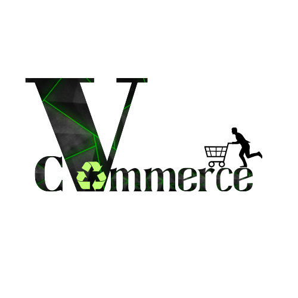

# VCommerce
<p align="center">
    
    
    
    
    
    
    
</p>

<p align="center">
    
</p>

Welcome to VCommerce, the ultimate platform for VIT University students to buy and sell their second-hand products. This project aims to create a connection ground between senior students looking to sell their items and juniors seeking cost-effective solutions for their needs, whether it's textbooks, bicycles, electronics, or electrical devices.

## Table of Contents

- [Features](#features)
- [Getting Started](#getting-started)
  - [Prerequisites](#prerequisites)
  - [Installation](#installation)
- [Usage](#usage)


## Features

- **User Profiles**: Users can create personalized profiles, making it easy to track their activities and interact with others.

- **Product Listings**: Post detailed product listings with images, descriptions, and prices.

- **Search and Filters**: Efficient search functionality with filters for easy product discovery.

- **Messaging System**: Built-in messaging system to communicate with sellers/buyers securely.

- **Feedback and Ratings**: Leave reviews and ratings for users to build trust in the community.

- **Categories**: Categorize your products for a better browsing experience.

- **Mobile-Responsive**: The website is designed to work seamlessly on various devices.

## Getting Started

These instructions will help you set up a local development or production environment of VCommerce.

### Prerequisites

To run the project, you will need:

- [Node.js](https://nodejs.org/) (v14 or higher)
- [npm](https://www.npmjs.com/) (usually comes with Node.js installation)
- [MongoDB](https://www.mongodb.com/) (either installed locally or use a cloud-based solution)

### Installation

1. Clone the repository:

   ```bash
   git clone https://github.com/yourusername/VCommerce.git
   ```
2. Navigate to the project directory:
   ```bash
   cd VCommerce
   ```
3. Install the required dependencies:
   ```bash
   cd backend && npm i
   cd ..
   cd fronend && npm i
   ```
4. Create a .env file in the root directory and set the necessary environment variables mentioned in config.env.example
5. Start the backend and frontend server
   ```bash
    cd backend && npm run dev
    cd frontend && npm run dev
   ```
6. Access the application in your browser at http://localhost:5173.

## Usage

1. **User Registration and Login**: Users can register and log in to their accounts.

2. **User Profile Management**: Users can manage their profiles and update their information on the application.

3. **Product Listing**: Post products you want to sell with detailed descriptions and images.

4. **Product Management**: Update product information that have been listed by you, and delete them once sold.

5. **Enjoy Buying and Selling!**: VCommerce is your platform for all your buying and selling needs within the VIT University community.

## Contributing

We welcome contributions from the community. If you would like to contribute to the project, please follow our [Contributing Guidelines](CONTRIBUTING.md).

## License

This project is licensed under the MIT License - see the [LICENSE](LICENSE) file for details.

